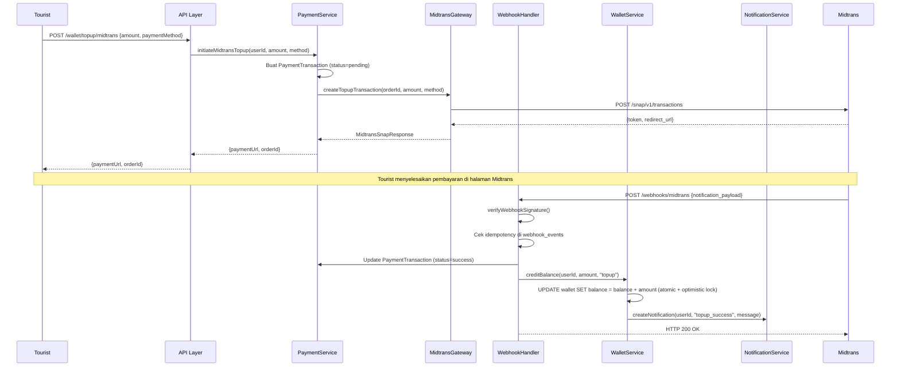
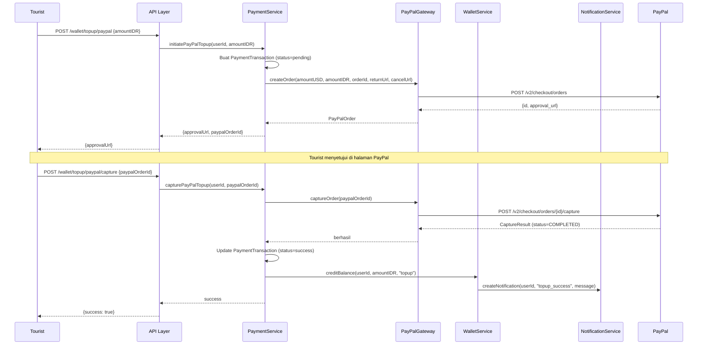
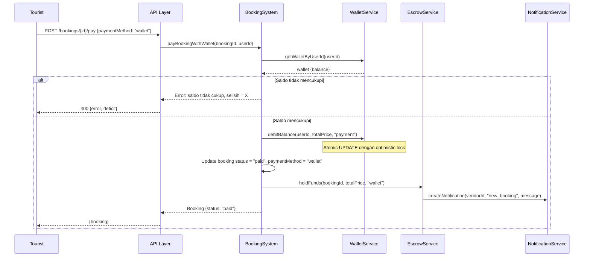
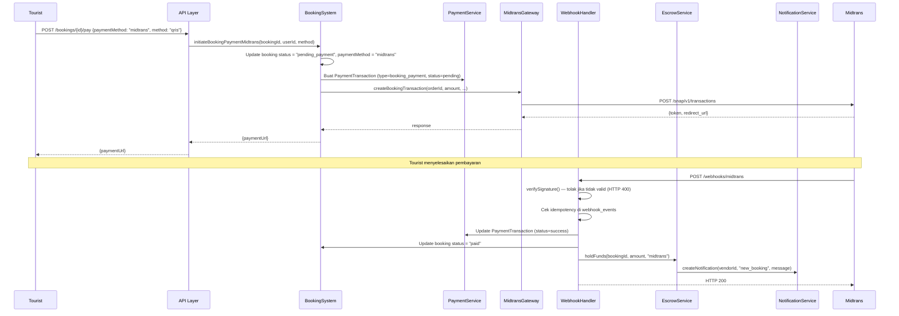
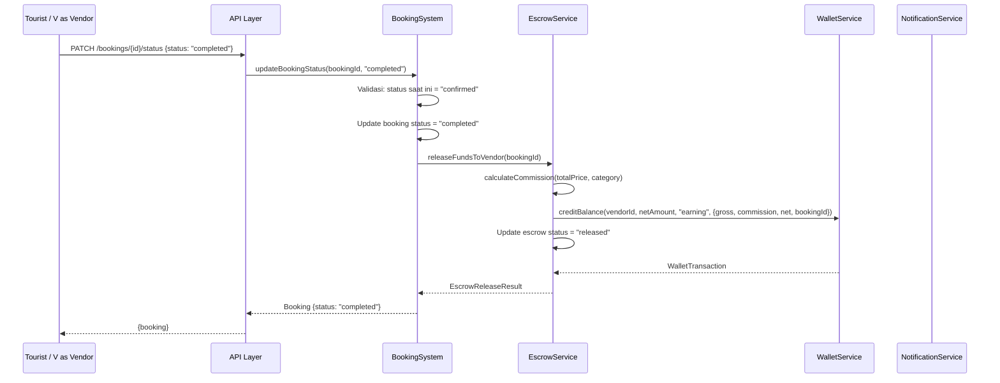
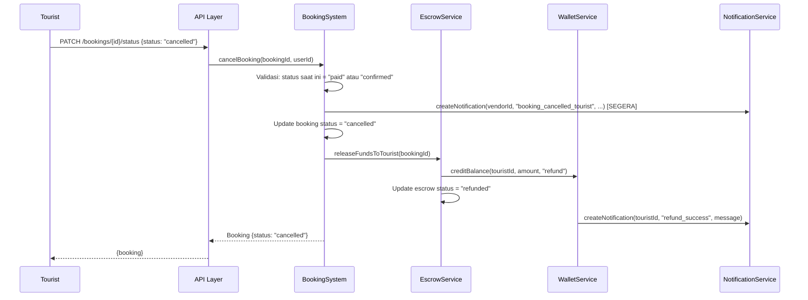

# Design Document — Payment, Wallet & Booking (payment-wallet-booking)

## Overview

Fitur ini menambahkan sistem keuangan lengkap ke Lampira. Sebelum fitur ini, sistem booking tidak memiliki mekanisme pembayaran — tourist bisa membuat booking tetapi tidak ada aliran uang. Fitur ini menutup celah tersebut dengan menghadirkan:

1. **Dompet Digital (Wallet)** — setiap tourist dan vendor memiliki saldo dalam platform.
2. **Topup** — tourist mengisi saldo via Midtrans (QRIS, Virtual Account) atau PayPal (Orders API).
3. **Pembayaran Booking** — tourist memilih metode bayar saat booking; dana masuk ke escrow.
4. **Escrow & Pelepasan Dana** — dana ditahan sampai booking selesai, lalu dilepas ke vendor dikurangi komisi.
5. **Withdraw** — vendor menarik saldo ke rekening bank eksternal melalui persetujuan admin.
6. **Notifikasi In-App** — pemberitahuan pada setiap tahap penting (topup, booking paid, confirmed, completed, refund, dll).
7. **Webhook Handler** — konfirmasi otomatis dari Midtrans dan PayPal.

Semua operasi keuangan dijamin atomik, idempoten, dan aman dari race condition.

---

## Architecture

### High-Level Overview

```
┌───────────────────────────────────────────────────────────────────────────┐
│                          CLIENT (Web / Mobile)                            │
└─────────────────────────────────┬─────────────────────────────────────────┘
                                  │ HTTP/REST
┌─────────────────────────────────▼─────────────────────────────────────────┐
│                         API LAYER (Hono/Express)                          │
│                                                                           │
│  /wallet   /topup   /bookings/:id/pay   /escrow   /withdraw               │
│  /notifications   /webhooks/midtrans   /webhooks/paypal                   │
└────┬─────────────┬──────────────┬──────────────────┬──────────────────────┘
     │             │              │                  │
┌────▼──────┐ ┌───▼────────┐ ┌──▼──────────┐ ┌────▼─────────────┐
│ Wallet    │ │ Payment    │ │ Escrow      │ │ Notification     │
│ Service   │ │ Service    │ │ Service     │ │ Service          │
└────┬──────┘ └───┬────────┘ └──┬──────────┘ └──────────────────┘
     │             │              │
     │         ┌───▼────────┐     │
     │         │  Gateway   │     │
     │         │  Layer     │     │
     │         │            │     │
     │         │ Midtrans   │     │
     │         │ Gateway    │     │
     │         │            │     │
     │         │ PayPal     │     │
     │         │ Gateway    │     │
     │         └───┬────────┘     │
     │             │              │
┌────▼─────────────▼──────────────▼──────────────────────────────┐
│                     DATABASE (PostgreSQL via Drizzle ORM)        │
│                                                                  │
│  wallets  wallet_transactions  payment_transactions  escrow_     │
│  records  withdraw_requests   notifications  webhook_events      │
│  bookings (extended)                                             │
└──────────────────────────────────────────────────────────────────┘
         ▲                              ▲
         │                              │
┌────────┴──────────┐         ┌────────┴──────────┐
│  Midtrans Webhook │         │  PayPal Webhook   │
│  /webhooks/       │         │  /webhooks/       │
│  midtrans         │         │  paypal           │
└───────────────────┘         └───────────────────┘
```

### Prinsip Desain

- **Layered Architecture** — API layer, Service layer, Gateway layer, dan Database layer terpisah jelas.
- **Single Responsibility** — setiap service menangani satu domain (wallet, payment, escrow, notifikasi).
- **Idempotency** — semua webhook handler idempoten menggunakan `webhookEventId` sebagai deduplication key.
- **Atomic Transactions** — semua mutasi finansial dibungkus dalam satu database transaction.
- **Optimistic Locking** — saldo wallet menggunakan versi counter untuk mencegah race condition.

---

## Components and Interfaces

### WalletService

Mengelola saldo dan mutasi wallet untuk semua user.

```typescript
interface WalletService {
  // Membuat wallet baru untuk user (dipanggil saat registrasi)
  createWallet(userId: number): Promise<Wallet>;

  // Mendapatkan wallet berdasarkan userId
  getWalletByUserId(userId: number): Promise<Wallet>;

  // Menambah saldo — atomik dengan optimistic locking
  creditBalance(
    userId: number,
    amount: number,
    type: WalletTransactionType,
    meta: WalletTransactionMeta
  ): Promise<WalletTransaction>;

  // Mengurangi saldo — atomik, gagal jika saldo tidak cukup
  debitBalance(
    userId: number,
    amount: number,
    type: WalletTransactionType,
    meta: WalletTransactionMeta
  ): Promise<WalletTransaction>;

  // Memblokir saldo untuk withdraw (tidak dapat digunakan)
  lockBalance(userId: number, amount: number): Promise<void>;

  // Melepaskan blokir saldo
  unlockBalance(userId: number, amount: number): Promise<void>;

  // Mengurangi saldo terkunci saat withdraw dikonfirmasi
  deductLockedBalance(userId: number, amount: number): Promise<void>;

  // Mendapatkan riwayat mutasi wallet dengan pagination
  getTransactionHistory(
    userId: number,
    page: number,
    limit: number
  ): Promise<{ data: WalletTransaction[]; total: number }>;

  // Badge counter — jumlah notifikasi belum dibaca (dipanggil dari NotificationService)
  getUnreadNotificationCount(userId: number): Promise<number>;
}
```

### PaymentService

Mengorkestrasi alur pembayaran — topup, pembayaran booking, dan withdraw.

```typescript
interface PaymentService {
  // Inisiasi topup via Midtrans — mengembalikan URL/token pembayaran
  initiateMidtransTopup(
    userId: number,
    amount: number,
    paymentMethod: MidtransPaymentMethod
  ): Promise<MidtransTopupResponse>;

  // Inisiasi topup via PayPal — mengembalikan approval URL
  initiatePayPalTopup(userId: number, amountIDR: number): Promise<PayPalTopupResponse>;

  // Capture PayPal Order setelah tourist menyetujui
  capturePayPalTopup(userId: number, paypalOrderId: string): Promise<void>;

  // Pembayaran booking via wallet — debit langsung
  payBookingWithWallet(bookingId: number, userId: number): Promise<void>;

  // Inisiasi pembayaran booking via Midtrans
  initiateBookingPaymentMidtrans(
    bookingId: number,
    userId: number,
    paymentMethod: MidtransPaymentMethod
  ): Promise<MidtransPaymentResponse>;

  // Inisiasi pembayaran booking via PayPal
  initiateBookingPaymentPayPal(bookingId: number, userId: number): Promise<PayPalPaymentResponse>;

  // Refund ke wallet tourist (dipanggil dari EscrowService)
  refundToWallet(bookingId: number): Promise<void>;

  // Buat permintaan withdraw vendor
  createWithdrawRequest(
    vendorId: number,
    amount: number,
    bankInfo: BankInfo
  ): Promise<WithdrawRequest>;

  // Admin: konfirmasi atau tolak withdraw
  processWithdrawRequest(
    withdrawId: number,
    action: "approve" | "reject"
  ): Promise<WithdrawRequest>;

  // Menandai transaksi kedaluwarsa (dipanggil oleh scheduler)
  expireStaleTransactions(): Promise<void>;
}
```

### EscrowService

Mengelola penahanan dan pelepasan dana booking.

```typescript
interface EscrowService {
  // Menahan dana pembayaran booking
  holdFunds(bookingId: number, amount: number, source: EscrowSource): Promise<EscrowRecord>;

  // Melepas dana ke vendor setelah booking completed (potong komisi)
  releaseFundsToVendor(bookingId: number): Promise<EscrowReleaseResult>;

  // Melepas dana kembali ke tourist (refund)
  releaseFundsToTourist(bookingId: number): Promise<void>;

  // Mendapatkan escrow record berdasarkan bookingId
  getEscrowByBookingId(bookingId: number): Promise<EscrowRecord>;

  // Menghitung komisi berdasarkan kategori listing
  calculateCommission(totalPrice: number, category: ListingCategory): number;
}
```

### NotificationService

Membuat dan mengelola notifikasi in-app.

```typescript
interface NotificationService {
  // Membuat notifikasi baru
  createNotification(
    userId: number,
    type: NotificationType,
    message: string,
    meta?: Record<string, unknown>
  ): Promise<Notification>;

  // Mendapatkan daftar notifikasi pengguna (urut terbaru, dengan pagination)
  getNotifications(
    userId: number,
    page: number,
    limit: number
  ): Promise<{ data: Notification[]; total: number; unreadCount: number }>;

  // Menandai satu notifikasi sebagai dibaca
  markAsRead(notificationId: number, userId: number): Promise<Notification>;

  // Menandai semua notifikasi sebagai dibaca
  markAllAsRead(userId: number): Promise<void>;

  // Badge counter
  getUnreadCount(userId: number): Promise<number>;
}
```

### MidtransGateway

Wrapper untuk Midtrans Snap API dan Core API.

```typescript
interface MidtransGateway {
  // Membuat transaksi topup via Snap
  createTopupTransaction(
    orderId: string,
    amount: number,
    paymentMethod: MidtransPaymentMethod,
    customerDetails: CustomerDetails
  ): Promise<MidtransSnapResponse>;

  // Membuat transaksi pembayaran booking
  createBookingTransaction(
    orderId: string,
    amount: number,
    paymentMethod: MidtransPaymentMethod,
    bookingDetails: BookingDetails,
    customerDetails: CustomerDetails
  ): Promise<MidtransSnapResponse>;

  // Verifikasi signature webhook
  verifyWebhookSignature(
    orderId: string,
    statusCode: string,
    grossAmount: string,
    signatureKey: string
  ): boolean;

  // Mendapatkan status transaksi dari Midtrans
  getTransactionStatus(orderId: string): Promise<MidtransTransactionStatus>;
}
```

### PayPalGateway

Wrapper untuk PayPal Orders API v2.

```typescript
interface PayPalGateway {
  // Membuat PayPal Order baru
  createOrder(
    amountUSD: number,
    amountIDR: number,
    referenceId: string,
    returnUrl: string,
    cancelUrl: string
  ): Promise<PayPalOrder>;

  // Capture PayPal Order yang sudah disetujui
  captureOrder(orderId: string): Promise<PayPalCaptureResult>;

  // Verifikasi webhook PayPal menggunakan PayPal Webhook Verification API
  verifyWebhook(
    headers: Record<string, string>,
    body: string,
    webhookId: string
  ): Promise<boolean>;

  // Mendapatkan access token (auto-refresh)
  getAccessToken(): Promise<string>;
}
```

### WebhookHandler

Menerima dan memproses callback dari payment gateway.

```typescript
interface WebhookHandler {
  // Handler webhook Midtrans
  handleMidtransWebhook(
    payload: MidtransWebhookPayload,
    signatureKey: string
  ): Promise<void>;

  // Handler webhook PayPal
  handlePayPalWebhook(
    headers: Record<string, string>,
    rawBody: string
  ): Promise<void>;
}
```

---

## Data Models

### Skema Database

Berikut adalah semua tabel baru dan perubahan pada tabel yang sudah ada.

#### Perubahan pada `bookingsTable`

Dua kolom ditambahkan ke tabel `bookings` yang sudah ada:

```typescript
// lib/db/src/schema/bookings.ts
import {
  pgTable, serial, text, timestamp, real, integer, date, pgEnum
} from "drizzle-orm/pg-core";

export const bookingStatusEnum = pgEnum("booking_status", [
  "pending",          // booking dibuat, belum ada pembayaran
  "pending_payment",  // BARU: pembayaran via gateway dimulai, menunggu konfirmasi
  "paid",             // BARU: pembayaran dikonfirmasi, menunggu konfirmasi vendor
  "confirmed",        // vendor telah mengkonfirmasi
  "completed",        // servis selesai
  "cancelled",        // dibatalkan (oleh tourist, vendor, atau timeout)
]);

export const bookingsTable = pgTable("bookings", {
  id: serial("id").primaryKey(),
  listingId: integer("listing_id").notNull(),
  userId: integer("user_id").notNull(),
  status: bookingStatusEnum("status").notNull().default("pending"),
  totalPrice: real("total_price").notNull(),
  commissionAmount: real("commission_amount"),
  guests: integer("guests").notNull().default(1),
  checkInDate: date("check_in_date", { mode: "string" }).notNull(),
  checkOutDate: date("check_out_date", { mode: "string" }),
  notes: text("notes"),
  // KOLOM BARU:
  paymentMethod: text("payment_method"),  // wallet|midtrans|paypal
  createdAt: timestamp("created_at", { withTimezone: true }).notNull().defaultNow(),
  updatedAt: timestamp("updated_at", { withTimezone: true }).notNull().defaultNow().$onUpdate(() => new Date()),
});
```

**Alasan penambahan status `pending_payment` dan `paid`:** Booking yang dibuat via gateway eksternal memerlukan waktu konfirmasi. `pending_payment` menandai bahwa pembayaran dimulai; `paid` menandai bahwa gateway mengkonfirmasi pembayaran berhasil.

#### Tabel `wallets`

```typescript
// lib/db/src/schema/wallets.ts
export const walletsTable = pgTable("wallets", {
  id: serial("id").primaryKey(),
  userId: integer("user_id").notNull().unique(),   // FK ke usersTable.id
  balance: real("balance").notNull().default(0),   // saldo tersedia (IDR)
  lockedBalance: real("locked_balance").notNull().default(0), // saldo terkunci untuk withdraw
  version: integer("version").notNull().default(0), // optimistic locking counter
  currency: text("currency").notNull().default("IDR"),
  createdAt: timestamp("created_at", { withTimezone: true }).notNull().defaultNow(),
  updatedAt: timestamp("updated_at", { withTimezone: true }).notNull().defaultNow().$onUpdate(() => new Date()),
});
```

**Catatan desain:** `lockedBalance` adalah saldo yang sudah di-reserve untuk withdraw aktif — tidak dapat digunakan untuk transaksi lain. `version` adalah counter untuk optimistic locking: setiap UPDATE saldo harus menyertakan `WHERE version = :currentVersion` dan INCREMENT version.

#### Tabel `wallet_transactions`

```typescript
// lib/db/src/schema/wallet_transactions.ts
export const walletTransactionTypeEnum = pgEnum("wallet_transaction_type", [
  "topup",       // penambahan saldo dari topup
  "payment",     // pengurangan saldo untuk pembayaran booking
  "refund",      // penambahan saldo dari refund
  "earning",     // penambahan saldo vendor dari booking completed
  "withdraw",    // pengurangan saldo untuk withdraw
]);

export const walletTransactionsTable = pgTable("wallet_transactions", {
  id: serial("id").primaryKey(),
  walletId: integer("wallet_id").notNull(),         // FK ke walletsTable.id
  type: walletTransactionTypeEnum("type").notNull(),
  amount: real("amount").notNull(),                 // positif = kredit, negatif = debit
  balanceBefore: real("balance_before").notNull(),  // saldo sebelum transaksi
  balanceAfter: real("balance_after").notNull(),    // saldo sesudah transaksi
  // Untuk earning: detail komisi
  grossAmount: real("gross_amount"),                // total harga booking (sebelum komisi)
  commissionAmount: real("commission_amount"),      // jumlah komisi yang dipotong
  netAmount: real("net_amount"),                    // jumlah yang diterima vendor
  // Referensi ke entitas terkait
  bookingId: integer("booking_id"),                 // FK ke bookingsTable.id (nullable)
  paymentTransactionId: integer("payment_transaction_id"), // FK ke payment_transactions.id (nullable)
  description: text("description").notNull(),
  createdAt: timestamp("created_at", { withTimezone: true }).notNull().defaultNow(),
});
```

#### Tabel `payment_transactions`

```typescript
// lib/db/src/schema/payment_transactions.ts
export const paymentStatusEnum = pgEnum("payment_status", [
  "pending",    // menunggu konfirmasi
  "success",    // berhasil dikonfirmasi
  "failed",     // gagal
  "expired",    // kedaluwarsa (>24 jam tanpa konfirmasi)
  "refunded",   // sudah direfund
]);

export const paymentTransactionsTable = pgTable("payment_transactions", {
  id: serial("id").primaryKey(),
  userId: integer("user_id").notNull(),             // FK ke usersTable.id
  bookingId: integer("booking_id"),                 // FK ke bookingsTable.id (null untuk topup)
  type: text("type").notNull(),                     // topup|booking_payment
  gateway: text("gateway").notNull(),               // midtrans|paypal|wallet
  gatewayOrderId: text("gateway_order_id"),         // ID transaksi di gateway (Midtrans order_id / PayPal order_id)
  gatewayPaymentId: text("gateway_payment_id"),     // ID pembayaran spesifik dari gateway
  amount: real("amount").notNull(),                 // jumlah dalam IDR
  status: paymentStatusEnum("status").notNull().default("pending"),
  paymentMethod: text("payment_method"),            // qris|bca_va|bni_va|bri_va|mandiri_va|permata_va|paypal|wallet
  gatewayResponse: text("gateway_response"),        // raw response JSON dari gateway (untuk audit)
  expiredAt: timestamp("expired_at", { withTimezone: true }), // waktu kedaluwarsa (24 jam dari createdAt)
  processedAt: timestamp("processed_at", { withTimezone: true }), // waktu konfirmasi diterima
  createdAt: timestamp("created_at", { withTimezone: true }).notNull().defaultNow(),
  updatedAt: timestamp("updated_at", { withTimezone: true }).notNull().defaultNow().$onUpdate(() => new Date()),
});
```

#### Tabel `escrow_records`

```typescript
// lib/db/src/schema/escrow_records.ts
export const escrowStatusEnum = pgEnum("escrow_status", [
  "holding",   // dana sedang ditahan
  "released",  // dana dilepas ke vendor
  "refunded",  // dana dikembalikan ke tourist
]);

export const escrowRecordsTable = pgTable("escrow_records", {
  id: serial("id").primaryKey(),
  bookingId: integer("booking_id").notNull().unique(), // FK ke bookingsTable.id
  touristId: integer("tourist_id").notNull(),          // FK ke usersTable.id
  vendorId: integer("vendor_id").notNull(),            // FK ke usersTable.id
  amount: real("amount").notNull(),                    // total dana yang ditahan (IDR)
  commissionAmount: real("commission_amount"),         // komisi platform (diisi saat released)
  netAmount: real("net_amount"),                       // dana bersih ke vendor (diisi saat released)
  status: escrowStatusEnum("status").notNull().default("holding"),
  heldAt: timestamp("held_at", { withTimezone: true }).notNull().defaultNow(),
  releasedAt: timestamp("released_at", { withTimezone: true }), // waktu dilepas
  createdAt: timestamp("created_at", { withTimezone: true }).notNull().defaultNow(),
  updatedAt: timestamp("updated_at", { withTimezone: true }).notNull().defaultNow().$onUpdate(() => new Date()),
});
```

#### Tabel `withdraw_requests`

```typescript
// lib/db/src/schema/withdraw_requests.ts
export const withdrawStatusEnum = pgEnum("withdraw_status", [
  "pending_withdrawal", // menunggu persetujuan admin
  "completed",          // sudah diproses dan saldo dikurangi
  "rejected",           // ditolak admin
]);

export const withdrawRequestsTable = pgTable("withdraw_requests", {
  id: serial("id").primaryKey(),
  vendorId: integer("vendor_id").notNull(),     // FK ke usersTable.id
  amount: real("amount").notNull(),             // jumlah yang ditarik
  bankName: text("bank_name").notNull(),        // nama bank (BCA, BNI, dll)
  bankAccountNumber: text("bank_account_number").notNull(), // nomor rekening
  bankAccountName: text("bank_account_name").notNull(),     // nama pemilik rekening
  status: withdrawStatusEnum("status").notNull().default("pending_withdrawal"),
  adminNote: text("admin_note"),               // catatan dari admin saat approval/rejection
  processedBy: integer("processed_by"),        // FK ke usersTable.id (admin yang memproses)
  processedAt: timestamp("processed_at", { withTimezone: true }),
  createdAt: timestamp("created_at", { withTimezone: true }).notNull().defaultNow(),
  updatedAt: timestamp("updated_at", { withTimezone: true }).notNull().defaultNow().$onUpdate(() => new Date()),
});
```

#### Tabel `notifications`

```typescript
// lib/db/src/schema/notifications.ts
export const notificationTypeEnum = pgEnum("notification_type", [
  "topup_success",           // Tourist: topup berhasil
  "booking_confirmed",       // Tourist: booking dikonfirmasi vendor
  "booking_rejected",        // Tourist: booking ditolak vendor
  "booking_cancelled_tourist", // Vendor: tourist membatalkan booking
  "refund_success",          // Tourist: refund diterima
  "new_booking",             // Vendor: booking baru masuk
  "withdraw_processed",      // Vendor: withdraw diproses
  "withdraw_rejected",       // Vendor: withdraw ditolak
]);

export const notificationsTable = pgTable("notifications", {
  id: serial("id").primaryKey(),
  userId: integer("user_id").notNull(),         // FK ke usersTable.id
  type: notificationTypeEnum("type").notNull(),
  message: text("message").notNull(),
  isRead: integer("is_read").notNull().default(0), // 0 = belum dibaca, 1 = sudah dibaca
  meta: text("meta"),                           // JSON string untuk data tambahan
  createdAt: timestamp("created_at", { withTimezone: true }).notNull().defaultNow(),
  updatedAt: timestamp("updated_at", { withTimezone: true }).notNull().defaultNow().$onUpdate(() => new Date()),
});
```

**Catatan:** `isRead` menggunakan integer (0/1) karena PostgreSQL via Drizzle lebih konsisten dengan integer untuk boolean sederhana pada tabel yang sering di-query.

#### Tabel `webhook_events`

```typescript
// lib/db/src/schema/webhook_events.ts
export const webhookEventStatusEnum = pgEnum("webhook_event_status", [
  "received",   // diterima, belum diproses
  "processed",  // berhasil diproses
  "failed",     // gagal diproses
  "duplicate",  // duplikat, diabaikan
]);

export const webhookEventsTable = pgTable("webhook_events", {
  id: serial("id").primaryKey(),
  gateway: text("gateway").notNull(),            // midtrans|paypal
  eventId: text("event_id").notNull().unique(),  // ID unik dari gateway (untuk idempotency)
  eventType: text("event_type").notNull(),       // transaction.success, PAYMENT.CAPTURE.COMPLETED, dll
  orderId: text("order_id"),                     // order ID di gateway
  rawPayload: text("raw_payload").notNull(),     // raw JSON payload untuk audit
  status: webhookEventStatusEnum("status").notNull().default("received"),
  errorMessage: text("error_message"),          // pesan error jika status = failed
  processedAt: timestamp("processed_at", { withTimezone: true }),
  createdAt: timestamp("created_at", { withTimezone: true }).notNull().defaultNow(),
});
```

**Kunci idempotency:** Sebelum memproses webhook, handler memeriksa apakah `eventId` sudah ada di tabel ini. Jika sudah ada, return 200 tanpa memproses ulang.

---

### Tabel Tarif Komisi

| Kategori Listing | Tarif Komisi | Contoh: Booking Rp 1.000.000 |
|-----------------|-------------|------------------------------|
| transportation  | 12%         | Komisi Rp 120.000, Net Rp 880.000 |
| accommodation   | 10%         | Komisi Rp 100.000, Net Rp 900.000 |
| restaurant      | 5%          | Komisi Rp 50.000, Net Rp 950.000  |
| tour            | 15%         | Komisi Rp 150.000, Net Rp 850.000 |
| event           | 10%         | Komisi Rp 100.000, Net Rp 900.000 |
| guide           | 10%         | Komisi Rp 100.000, Net Rp 900.000 |
| souvenir        | 5%          | Komisi Rp 50.000, Net Rp 950.000  |

```typescript
// Tabel komisi sebagai konstanta dalam kode
export const COMMISSION_RATES: Record<string, number> = {
  transportation: 0.12,
  accommodation:  0.10,
  restaurant:     0.05,
  tour:           0.15,
  event:          0.10,
  guide:          0.10,
  souvenir:       0.05,
} as const;

export function calculateCommission(totalPrice: number, category: string): {
  commissionAmount: number;
  netAmount: number;
} {
  const rate = COMMISSION_RATES[category] ?? 0.10; // default 10% jika kategori tidak dikenal
  const commissionAmount = Math.round(totalPrice * rate); // bulatkan ke IDR terdekat
  return { commissionAmount, netAmount: totalPrice - commissionAmount };
}
```

---

## Payment Flow Diagrams

### Alur 1: Topup via Midtrans



### Alur 2: Topup via PayPal



### Alur 3: Pembayaran Booking via Wallet



### Alur 4: Pembayaran Booking via Midtrans + Konfirmasi Webhook



### Alur 5: Penyelesaian Booking & Pelepasan Dana ke Vendor



### Alur 6: Refund (Pembatalan oleh Tourist atau Penolakan oleh Vendor)



---

## API Endpoints

### Tag dan Prefix

Semua endpoint baru menggunakan prefix `/api` (sesuai existing OpenAPI spec) dan dikelompokkan dalam tag baru:
- `wallet` — operasi wallet
- `payments` — topup dan pembayaran
- `withdraw` — penarikan saldo vendor
- `notifications` — notifikasi in-app
- `webhooks` — callback dari gateway

### Daftar Endpoint Baru

#### Wallet

```yaml
GET  /wallet          # Mendapatkan info wallet dan saldo pengguna saat ini
GET  /wallet/history  # Riwayat mutasi wallet (dengan pagination)
```

#### Topup

```yaml
POST /wallet/topup/midtrans          # Inisiasi topup via Midtrans
POST /wallet/topup/paypal            # Inisiasi topup via PayPal (create order)
POST /wallet/topup/paypal/capture    # Capture PayPal Order setelah approval
```

#### Pembayaran Booking

```yaml
POST /bookings/{id}/pay              # Pembayaran booking (wallet/midtrans/paypal)
GET  /bookings/{id}/payment-status   # Status pembayaran booking
```

#### Withdraw (Vendor)

```yaml
POST /withdraw                       # Buat permintaan withdraw
GET  /withdraw                       # Riwayat permintaan withdraw vendor
GET  /withdraw/{id}                  # Detail permintaan withdraw
```

#### Admin — Withdraw

```yaml
GET   /admin/withdraw                # Daftar semua permintaan withdraw
PATCH /admin/withdraw/{id}           # Approve atau reject withdraw
```

#### Notifikasi

```yaml
GET  /notifications              # Daftar notifikasi pengguna (pagination, urut terbaru)
GET  /notifications/unread-count # Badge counter notifikasi belum dibaca
PATCH /notifications/{id}/read   # Tandai satu notifikasi sebagai dibaca
PATCH /notifications/read-all    # Tandai semua notifikasi sebagai dibaca
```

#### Webhooks

```yaml
POST /webhooks/midtrans  # Endpoint callback Midtrans
POST /webhooks/paypal    # Endpoint callback PayPal
```

### Contoh Request/Response Bodies

#### `POST /wallet/topup/midtrans`

Request:
```json
{
  "amount": 500000,
  "paymentMethod": "qris"
}
```

Response `201`:
```json
{
  "transactionId": 42,
  "paymentUrl": "https://app.sandbox.midtrans.com/snap/...",
  "orderId": "TOPUP-USER1-1720000000",
  "expiresAt": "2025-07-04T10:00:00Z"
}
```

#### `POST /bookings/{id}/pay`

Request:
```json
{
  "paymentMethod": "wallet"
}
```

Response `200` (berhasil via wallet):
```json
{
  "bookingId": 15,
  "status": "paid",
  "paymentMethod": "wallet",
  "amountPaid": 350000
}
```

Response `200` (via Midtrans — mengembalikan URL):
```json
{
  "bookingId": 15,
  "status": "pending_payment",
  "paymentMethod": "midtrans",
  "paymentUrl": "https://app.sandbox.midtrans.com/snap/...",
  "orderId": "BOOKING-15-1720000000"
}
```

Response `422` (saldo tidak cukup):
```json
{
  "error": "Saldo tidak mencukupi",
  "currentBalance": 200000,
  "requiredAmount": 350000,
  "deficit": 150000
}
```

---

## Security Design

### 1. Verifikasi Webhook Signature

#### Midtrans

Midtrans mengirimkan field `signature_key` dalam payload webhook. Signature dihitung sebagai:

```
SHA512(orderId + statusCode + grossAmount + serverKey)
```

Implementasi:

```typescript
import { createHash } from "node:crypto";

function verifyMidtransSignature(
  orderId: string,
  statusCode: string,
  grossAmount: string,
  incomingSignature: string
): boolean {
  const serverKey = process.env.MIDTRANS_SERVER_KEY!;
  const expectedSignature = createHash("sha512")
    .update(`${orderId}${statusCode}${grossAmount}${serverKey}`)
    .digest("hex");
  // Gunakan timingSafeEqual untuk mencegah timing attack
  return timingSafeCompare(expectedSignature, incomingSignature);
}
```

#### PayPal

PayPal menyediakan Webhook Verification API. Implementasi mengirimkan raw payload beserta header ke PayPal untuk diverifikasi:

```typescript
async function verifyPayPalWebhook(headers, rawBody, webhookId): Promise<boolean> {
  const accessToken = await paypalGateway.getAccessToken();
  const response = await fetch(
    "https://api-m.sandbox.paypal.com/v1/notifications/verify-webhook-signature",
    {
      method: "POST",
      headers: {
        Authorization: `Bearer ${accessToken}`,
        "Content-Type": "application/json",
      },
      body: JSON.stringify({
        transmission_id: headers["paypal-transmission-id"],
        transmission_time: headers["paypal-transmission-time"],
        cert_url: headers["paypal-cert-url"],
        auth_algo: headers["paypal-auth-algo"],
        transmission_sig: headers["paypal-transmission-sig"],
        webhook_id: webhookId,
        webhook_event: JSON.parse(rawBody),
      }),
    }
  );
  const { verification_status } = await response.json();
  return verification_status === "SUCCESS";
}
```

### 2. Idempotency Webhook

Sebelum memproses webhook, handler selalu memeriksa tabel `webhook_events`:

```typescript
async function handleMidtransWebhook(payload, signature) {
  // 1. Verifikasi signature
  if (!verifySignature(payload, signature)) {
    log.warn("Invalid Midtrans webhook signature", { orderId: payload.order_id });
    throw new HttpError(400, "Invalid signature");
  }

  // 2. Cek idempotency — gunakan transaction_id sebagai eventId
  const eventId = `midtrans-${payload.transaction_id}`;
  const existing = await db.query.webhookEventsTable.findFirst({
    where: eq(webhookEventsTable.eventId, eventId),
  });

  if (existing) {
    log.info("Duplicate webhook, skipping", { eventId });
    return; // return 200 tanpa proses ulang
  }

  // 3. Simpan event sebagai "received"
  await db.insert(webhookEventsTable).values({
    gateway: "midtrans",
    eventId,
    eventType: payload.transaction_status,
    orderId: payload.order_id,
    rawPayload: JSON.stringify(payload),
    status: "received",
  });

  // 4. Proses dalam database transaction atomik
  await db.transaction(async (tx) => {
    // ... update payment transaction, wallet, booking, escrow
  });

  // 5. Update status webhook event menjadi "processed"
  await db.update(webhookEventsTable)
    .set({ status: "processed", processedAt: new Date() })
    .where(eq(webhookEventsTable.eventId, eventId));
}
```

### 3. Optimistic Locking pada Wallet

Setiap UPDATE saldo wallet menyertakan kondisi versi untuk mencegah race condition:

```typescript
async function creditBalance(userId: number, amount: number, type, meta) {
  // Maksimal 3 kali retry jika terjadi version conflict
  for (let attempt = 0; attempt < 3; attempt++) {
    const wallet = await db.query.walletsTable.findFirst({
      where: eq(walletsTable.userId, userId),
    });

    if (!wallet) throw new Error("Wallet not found");

    const newBalance = wallet.balance + amount;
    const newVersion = wallet.version + 1;

    // UPDATE dengan WHERE version = currentVersion (optimistic lock)
    const result = await db
      .update(walletsTable)
      .set({ balance: newBalance, version: newVersion })
      .where(
        and(
          eq(walletsTable.userId, userId),
          eq(walletsTable.version, wallet.version) // versi harus cocok
        )
      )
      .returning();

    if (result.length > 0) {
      // Berhasil — catat wallet transaction
      await db.insert(walletTransactionsTable).values({
        walletId: wallet.id,
        type,
        amount,
        balanceBefore: wallet.balance,
        balanceAfter: newBalance,
        ...meta,
      });
      return result[0];
    }
    // version conflict — coba lagi
    await sleep(10 * (attempt + 1)); // backoff
  }
  throw new Error("Wallet update failed after 3 attempts (race condition)");
}
```

### 4. Transaksi Database Atomik

Semua operasi yang mengubah saldo wallet DAN status entitas lain harus dieksekusi dalam satu database transaction:

```typescript
// Contoh: releaseFundsToVendor — atomik
await db.transaction(async (tx) => {
  const escrow = await tx.query.escrowRecordsTable.findFirst({ ... });
  const { commissionAmount, netAmount } = calculateCommission(escrow.amount, category);

  // 1. Credit wallet vendor
  await creditBalanceTx(tx, vendorId, netAmount, "earning", { ... });

  // 2. Update escrow status
  await tx.update(escrowRecordsTable)
    .set({ status: "released", commissionAmount, netAmount, releasedAt: new Date() })
    .where(eq(escrowRecordsTable.bookingId, bookingId));

  // 3. Update booking.commissionAmount
  await tx.update(bookingsTable)
    .set({ commissionAmount })
    .where(eq(bookingsTable.id, bookingId));
});
// Jika ada yang gagal, seluruh transaksi di-rollback otomatis
```

---

## Error Handling

| Skenario | Status HTTP | Pesan Error |
|---------|-------------|-------------|
| Saldo wallet tidak cukup | 422 | "Saldo tidak mencukupi. Kekurangan: Rp X" |
| Booking bukan milik user | 403 | "Akses ditolak" |
| Booking tidak dalam status yang valid untuk operasi | 409 | "Operasi tidak valid untuk status booking saat ini: [status]" |
| Signature webhook tidak valid | 400 | "Invalid webhook signature" |
| Jumlah withdraw melebihi saldo | 422 | "Saldo tidak mencukupi untuk withdraw. Saldo tersedia: Rp X" |
| Webhook duplikat | 200 | (langsung return 200 tanpa error) |
| Race condition wallet (setelah 3 retry) | 500 | "Gagal memperbarui saldo. Silakan coba lagi." |
| Midtrans API error | 502 | "Layanan pembayaran sedang tidak tersedia. Silakan coba lagi." |
| PayPal API error | 502 | "Layanan pembayaran PayPal sedang tidak tersedia. Silakan coba lagi." |
| Transaksi topup kedaluwarsa | 410 | "Transaksi telah kedaluwarsa. Buat transaksi baru." |

Semua error loggable dicatat dengan konteks (userId, bookingId, orderId) tanpa mengekspos data sensitif ke client.

---

## Correctness Properties

*Sebuah properti adalah karakteristik atau perilaku yang harus berlaku pada semua eksekusi sistem yang valid — pada dasarnya, pernyataan formal tentang apa yang seharusnya dilakukan sistem. Properti berfungsi sebagai jembatan antara spesifikasi yang dapat dibaca manusia dan jaminan kebenaran yang dapat diverifikasi secara otomatis.*

### Property 1: Wallet dibuat dengan saldo nol untuk setiap user baru

*Untuk sembarang* user baru yang valid (tourist maupun vendor), setelah registrasi berhasil, tepat satu wallet harus ada dengan saldo 0 dan `lockedBalance` 0.

**Validates: Requirements 1.1, 8.1**

---

### Property 2: Saldo wallet tidak pernah negatif

*Untuk sembarang* urutan operasi wallet apapun (topup, payment, refund, withdraw), nilai `balance` di tabel wallets tidak boleh pernah turun di bawah 0.

**Validates: Requirements 1.4, 8.4**

---

### Property 3: Riwayat mutasi mencatat semua transaksi

*Untuk sembarang* N transaksi yang berhasil dilakukan pada sebuah wallet, tabel `wallet_transactions` harus memiliki tepat N entri yang berkaitan, dan setiap entri harus memiliki `balanceBefore`, `balanceAfter`, `amount`, dan `type` yang konsisten (balanceBefore + amount = balanceAfter untuk kredit; balanceBefore - abs(amount) = balanceAfter untuk debit).

**Validates: Requirements 1.3, 7.5, 8.3**

---

### Property 4: Topup berhasil menambah saldo tepat sebesar jumlah yang dikonfirmasi

*Untuk sembarang* jumlah topup yang valid (> 0, dalam IDR), setelah payment gateway mengkonfirmasi pembayaran berhasil (via webhook Midtrans atau PayPal capture), saldo wallet tourist harus bertambah tepat sebesar jumlah tersebut.

**Validates: Requirements 2.4, 3.3**

---

### Property 5: Transaksi yang gagal tidak mengubah saldo

*Untuk sembarang* transaksi topup atau booking payment yang statusnya `failed` atau `expired`, saldo wallet tourist harus persis sama dengan saldo sebelum transaksi tersebut dimulai, meskipun transaksi lain mungkin terjadi di antara waktu tersebut.

**Validates: Requirements 2.6, 3.5**

---

### Property 6: Webhook diverifikasi sebelum diproses

*Untuk sembarang* payload webhook dari Midtrans atau PayPal, jika signature tidak valid, maka webhook HARUS ditolak dengan HTTP 400 dan tidak ada perubahan data (saldo, status booking, escrow) yang terjadi.

**Validates: Requirements 2.3, 12.1, 12.2, 12.4**

---

### Property 7: Setiap topup berhasil menghasilkan notifikasi

*Untuk sembarang* topup yang berhasil dikonfirmasi (dari Midtrans maupun PayPal), tepat satu notifikasi dengan tipe `topup_success` harus dibuat untuk tourist yang bersangkutan.

**Validates: Requirements 2.5, 3.4**

---

### Property 8: Pembayaran booking via wallet mengurangi saldo tepat sebesar total harga

*Untuk sembarang* booking dengan `totalPrice = P` dan wallet tourist dengan `balance = B` dimana `B >= P`, setelah pembayaran berhasil maka `balance` wallet tourist harus menjadi tepat `B - P` dan status booking menjadi `paid`.

**Validates: Requirements 4.3**

---

### Property 9: Pembayaran booking ditolak jika saldo tidak mencukupi

*Untuk sembarang* pasangan (balance, totalPrice) dimana `balance < totalPrice`, percobaan pembayaran booking via wallet harus ditolak dengan informasi deficit yang benar (`deficit = totalPrice - balance`) dan saldo wallet tidak berubah.

**Validates: Requirements 4.2**

---

### Property 10: Metode pembayaran tersimpan di data booking

*Untuk sembarang* metode pembayaran yang dipilih oleh tourist (`wallet`, `midtrans`, atau `paypal`), nilai tersebut harus tersimpan di kolom `paymentMethod` pada baris booking yang bersangkutan.

**Validates: Requirements 4.5**

---

### Property 11: Webhook idempoten

*Untuk sembarang* webhook yang valid dan berhasil diproses, memproses ulang webhook yang sama (eventId identik) tidak boleh menghasilkan perubahan tambahan pada saldo wallet, status booking, atau record escrow.

**Validates: Requirements 12.5**

---

### Property 12: Tarif komisi tepat per kategori

*Untuk sembarang* booking yang selesai (status `completed`) dengan kategori listing C dan total harga P, jumlah komisi yang dihitung harus tepat sama dengan `P * COMMISSION_RATES[C]` (dibulatkan ke bilangan bulat IDR terdekat).

Tarif yang harus berlaku: transportation=12%, accommodation=10%, restaurant=5%, tour=15%, event=10%, guide=10%, souvenir=5%.

**Validates: Requirements 7.2, 7.3**

---

### Property 13: Vendor menerima dana bersih setelah booking selesai

*Untuk sembarang* booking yang berubah status menjadi `completed` dengan total harga P dan kategori C, saldo wallet vendor harus bertambah tepat sebesar `P - (P * COMMISSION_RATES[C])` (nilai neto).

**Validates: Requirements 7.4**

---

### Property 14: Refund mengembalikan saldo penuh ke tourist

*Untuk sembarang* booking yang dibatalkan (oleh tourist atau karena penolakan vendor) setelah pembayaran dikonfirmasi, saldo wallet tourist harus bertambah tepat sebesar `totalPrice` booking tersebut.

**Validates: Requirements 6.4, 10.2**

---

### Property 15: Withdraw ditolak jika jumlah melebihi saldo tersedia

*Untuk sembarang* pasangan (balance, withdrawAmount) dimana `withdrawAmount > balance`, permintaan withdraw harus ditolak dan saldo tidak berubah.

**Validates: Requirements 9.2**

---

### Property 16: Saldo terkunci sama dengan jumlah withdraw aktif

*Untuk sembarang* permintaan withdraw yang berstatus `pending_withdrawal` dengan jumlah W, nilai `lockedBalance` di wallet vendor harus bertambah tepat sebesar W setelah permintaan dibuat.

**Validates: Requirements 9.3**

---

### Property 17: Withdraw yang dikonfirmasi mengurangi saldo tepat

*Untuk sembarang* permintaan withdraw yang disetujui admin dengan jumlah W, saldo wallet vendor harus berkurang tepat sebesar W dan `lockedBalance` kembali ke nilai sebelum withdraw.

**Validates: Requirements 9.4**

---

### Property 18: Notifikasi memiliki semua atribut wajib

*Untuk sembarang* notifikasi yang dibuat oleh `NotificationService`, record di tabel `notifications` harus memiliki semua field berikut terisi dengan nilai valid: `userId`, `type`, `message`, `isRead` (default 0), `createdAt`.

**Validates: Requirements 11.4**

---

### Property 19: Daftar notifikasi diurutkan dari yang terbaru

*Untuk sembarang* pengguna dengan N notifikasi yang dibuat pada waktu berbeda, endpoint `GET /notifications` harus mengembalikan daftar dalam urutan descending berdasarkan `createdAt` (notifikasi paling baru di indeks 0).

**Validates: Requirements 11.5**

---

### Property 20: Badge counter sama dengan jumlah notifikasi belum dibaca

*Untuk sembarang* pengguna dengan N notifikasi yang belum dibaca (`isRead = 0`), endpoint `GET /notifications/unread-count` harus mengembalikan nilai tepat N. Setelah semua ditandai dibaca, nilai harus menjadi 0.

**Validates: Requirements 11.7, 11.8**

---

### Property 21: Setiap transaksi keuangan memiliki audit trail lengkap

*Untuk sembarang* transaksi pembayaran yang selesai diproses (berhasil maupun gagal), record di tabel `payment_transactions` harus memiliki: `status` akhir yang valid, `gatewayOrderId` atau `gatewayPaymentId` yang tidak null, dan `processedAt` yang tidak null.

**Validates: Requirements 13.3**

---

## Testing Strategy

### Pendekatan Ganda (Dual Testing)

Fitur ini menggunakan dua pendekatan pengujian yang saling melengkapi:

1. **Unit Tests** — menguji contoh konkrit, edge case, dan kondisi error.
2. **Property-Based Tests (PBT)** — memverifikasi properti universal di atas ratusan input yang digenerate secara acak.

### Library Property-Based Testing

Menggunakan **[fast-check](https://github.com/dubzzz/fast-check)** (TypeScript-native PBT library).

```bash
pnpm add -D fast-check
```

### Konfigurasi Property Tests

- Minimum **100 iterasi** per property test (fast-check default numRuns=100).
- Setiap property test diberi tag komentar referensi ke properti desain:

```typescript
// Feature: payment-wallet-booking, Property 2: Saldo wallet tidak pernah negatif
it("wallet balance never goes negative", async () => {
  await fc.assert(
    fc.asyncProperty(
      fc.array(fc.record({
        type: fc.constantFrom("credit", "debit"),
        amount: fc.float({ min: 1, max: 1_000_000, noNaN: true }),
      })),
      async (operations) => {
        const wallet = await createTestWallet();
        // Pastikan ada saldo awal untuk operasi debit
        await creditBalance(wallet.userId, 10_000_000, "topup", {});

        for (const op of operations) {
          if (op.type === "credit") {
            await creditBalance(wallet.userId, op.amount, "topup", {});
          } else {
            const current = await getWallet(wallet.userId);
            if (current.balance >= op.amount) {
              await debitBalance(wallet.userId, op.amount, "payment", {});
            }
          }
          const updated = await getWallet(wallet.userId);
          expect(updated.balance).toBeGreaterThanOrEqual(0);
        }
      }
    ),
    { numRuns: 100 }
  );
});
```

### Cakupan Unit Tests

Unit test berfokus pada:
- State transition booking (pending → pending_payment → paid → confirmed → completed/cancelled)
- Error handling Midtrans/PayPal API
- Proses refund dan timeout (24 jam)
- Admin approve/reject withdraw
- Mark as read notifikasi (single dan all)
- Response HTTP yang benar dari webhook handler

### Cakupan Integration Tests

Integration test (dengan mock gateway, real DB) berfokus pada:
- Midtrans Gateway — createTopupTransaction, getTransactionStatus
- PayPal Gateway — createOrder, captureOrder
- Alur webhook end-to-end (termasuk idempotency dengan dua request identik)
- Transaksi concurrent (dua topup bersamaan ke wallet yang sama)
- Admin report endpoint

### Test Runners dan Struktur

```
lib/
  services/
    wallet/
      wallet.service.test.ts         # unit + property tests
    payment/
      payment.service.test.ts        # unit tests
    escrow/
      escrow.service.test.ts         # unit + property tests (komisi)
    notification/
      notification.service.test.ts   # unit + property tests
  gateways/
    midtrans/
      midtrans.gateway.test.ts       # integration tests (mocked)
    paypal/
      paypal.gateway.test.ts         # integration tests (mocked)
  webhooks/
    webhook.handler.test.ts          # integration + property tests (idempotency)
```
